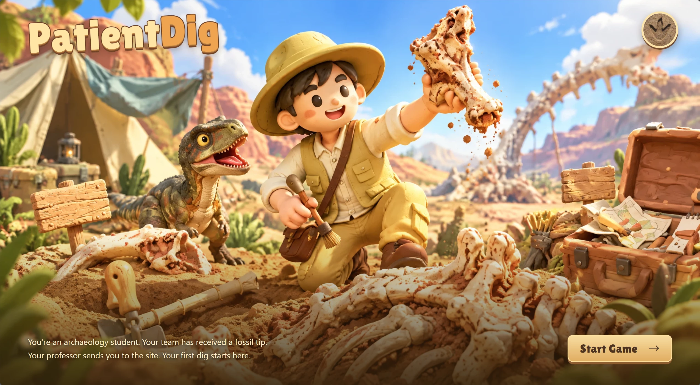
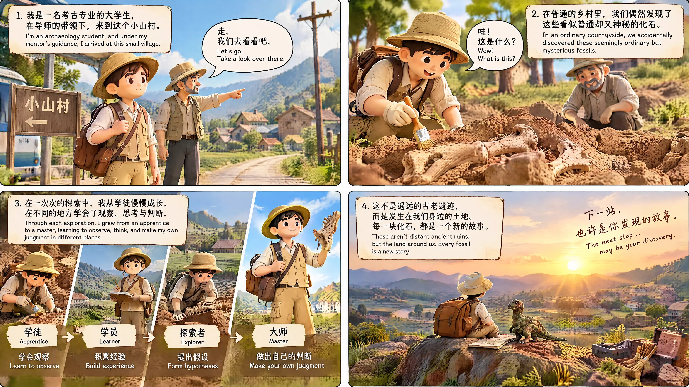
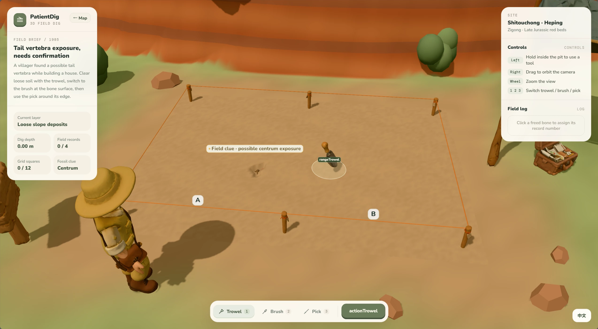

# PatientDig

[](assets/readme/cover.webp)

[中文说明](#中文说明) · [English](#english)

## 中文说明

PatientDig 是一个以真实化石发现故事为内容基础的 3D 浏览器游戏原型。玩家扮演学习地质与考古方向的大学生，从中国化石调查地图收到现场情报，前往四川自贡和平街道石头冲，在导师的指导下完成一次小型发掘、现场记录和科普图鉴归档。

游戏希望把“耐心挖掘”变成可理解的科学流程：先判断情报，再观察地层，使用合适的工具逐步清理，最后给每块骨骼编号并记录。场景使用粘土小人和风格化 3D 模型呈现，同时保留地点、年代、发现经过和化石名称等事实信息。

## 游戏流程

```text
PatientDig 封面
  → 四页全屏开场故事
  → 中国化石调查地图
  → 选择地点并阅读现场情报
  → 进入自贡石头冲发掘现场
  → 第一次操作时显示四页玩法提示
  → 小铲清理表土
  → 毛刷清理骨面细土
  → 竹签剔除骨骼边缘围岩
  → 点击已剥离骨骼并分配现场编号
  → 解锁和平永川龙图鉴卡片
```

## 当前内容

- **封面与开场**：PatientDig 品牌、圆形网页图标、背景音乐和四张全屏故事图。点击箭头逐页阅读后进入调查地图。
- **视觉预览**：下面三张图分别展示封面、四页开场叙事和 3D 发掘现场。

  <p align="center">
    
  </p>

  <p align="center">
    
  </p>

- **3D 中国调查地图**：地图以中国为调查范围，当前可玩地点是四川自贡和平街道石头冲；辽宁北票、广东河源等地点以区域情报和参考样本形式出现。
- **中英文界面**：地图页右上角和发掘页右下角都可以直接切换中文 / English，当前页面的文字会整体更新。
- **第一次操作教程**：发掘场景保持可见，第一次点击铲子或坑内区域时，屏幕变暗并显示四页透明底玩法提示。点击提示画面任意位置即可翻页，右侧箭头是辅助操作。
- **真实感工具顺序**：小铲适合清理较大面积松土；发现硬质骨面后换毛刷；骨骼边缘的薄层围岩再用竹签处理。场景中的工具、遮雨棚、标桩、工具箱、现场牌和人物均为 3D 模型。
- **四块化石线索**：现场分别记录椎体（centrum）、尾椎（tail vertebra）、肋骨片段（rib fragment）和零散骨片（scattered bone）。每块骨骼都会经历 `buried → glimpsed → exposed → freed → recorded` 的状态变化。
- **可玩性判定**：骨骼达到约 98% 表面露出时即可判定为剥离完成，避免玩家被最后一两个难以清理的土格卡住。
- **现场记录与图鉴**：点击已经剥离的骨骼进行编号；四块线索全部记录后，回到研究桌即可查看“和平永川龙（*Yangchuanosaurus hepingensis*）”科普卡片。
- **声音**：当前背景音乐使用 `assets/audio/patientdig-bgm.mp3`。地图页音量约为 22%，发掘页约为 11%；界面的 Sound / 声音按钮只控制背景音乐的暂停与恢复，不会关闭工具操作音效。

## 运行方式

最简单的方式是直接双击 [index.html](index.html)。项目已经把 Three.js 场景和 GLB 模型打包到 `dist/`，因此可以在本地 `file://` 地址下打开；如果浏览器限制本地资源加载，也可以在项目目录启动任意静态服务器。

安装依赖并重新构建：

```bash
npm install
npm run build          # 同时构建地图页和发掘页
npm run build:home    # 只构建 dist/home.js
npm run build:field   # 只构建 dist/dig3d.js
npm run watch         # 监听 3D 发掘代码并持续构建
```

构建产物由 [index.html](index.html) 和 [3d.html](3d.html) 引用。源代码分别位于 `src/home/` 与 `src/3d/`；修改源代码后运行 `npm run build`，再刷新页面即可看到更新。

## 操作说明

### 调查地图

- 鼠标拖动：环视 3D 地图。
- 滚轮：缩放。
- 点击地图标记或情报卡片：查看地点信息。
- `文 / English`：切换整套界面语言。
- `Sound / 声音`：暂停或恢复背景音乐。
- 底部导航：调查地图、野外图鉴、前往发掘。

### 发掘现场

- 左键按住坑内拖动：使用当前工具清理土层。
- 右键拖动：旋转镜头。
- 滚轮：缩放视角。
- 数字键 `1 / 2 / 3`：切换小铲、毛刷、竹签。
- 点击已剥离的骨骼：编号并写入现场记录。
- 教程出现时：点击屏幕任意位置进入下一页；最后一页关闭提示并继续发掘。

## 目录结构

```text
prototype/
├─ index.html                 # 封面、开场故事、调查地图、图鉴
├─ 3d.html                    # 3D 发掘现场
├─ package.json               # 构建与测试脚本
├─ dist/                      # esbuild 生成的浏览器脚本
├─ src/home/                  # 地图页、封面、音乐和中英文文案
├─ src/3d/                    # 场景、地层、工具、化石、教程和图鉴逻辑
├─ assets/
│  ├─ opt/                    # 优化后的 GLB 模型
│  ├─ anim/                   # 人物与工具动画模型
│  ├─ story/                  # 四页开场故事图
│  ├─ tutorial/               # 四页发掘提示图
│  ├─ maps/                   # 中国省区地图数据
│  ├─ audio/                  # 背景音乐
│  ├─ fonts/                  # 游戏字体
│  └─ previews/               # 模型预览图
├─ tests/                     # 冒烟、页面和浏览器测试
└─ tools/                     # GLB 优化与素材处理脚本
```

## 技术实现

- [Three.js](https://threejs.org/) 与 `OrbitControls`：地图、人物、发掘坑和工具的实时 3D 渲染。
- `esbuild`：将 `src/` 中的模块和 GLB 二进制资源打包到 `dist/`。
- CanvasTexture / Sprite：在 3D 场景中绘制地点标签、骨骼编号和现场提示。
- Web Audio API 与 `HTMLAudioElement`：背景音乐和轻量工具反馈音效。
- `localStorage`：保存已完成的图鉴记录，让地图页知道和平永川龙是否已经归档。
- Tripo 生成的 GLB 素材经过 `tools/optimize_glb.py` 处理，并在 `assets/opt/` 中作为运行时资源使用。

## 验证

```bash
npm test
npm run test:home
node tests/cover.mjs
node tests/3d-language.mjs
```

浏览器测试需要 Chrome 或 Edge、可用的 WebGL 环境，并会在 `tests/out/` 生成被 `.gitignore` 忽略的临时文件。若只想确认构建是否正常，运行 `npm run build` 即可。

## 事实边界

石头冲、1985 年当地村民修房时发现尾椎、后续采集与修理获得和平永川龙的叙事，参考了自贡恐龙博物馆等公开资料。地图上的地点情报也用于表达中国不同地区的化石发现线索。

发掘坑的尺寸、地形比例、土格位置、四块化石的摆放、清理顺序和约 98% 的完成判定是为了让原型可玩而做的设计适配；它们不是正式发掘报告中的标本坐标。Tripo 模型是风格化教育素材，不能替代真实标本鉴定，也不应据此进行物种或解剖学判断。

## English

PatientDig is a 3D browser game prototype about patient, evidence-based fossil fieldwork. You play a geology and archaeology student who receives a field lead on a China fossil survey map. Following your mentor’s instructions, you travel to Shitouchong in Heping, Zigong, Sichuan, complete a small excavation, record the finds, and unlock a bilingual field-guide entry.

The project turns a careful field method into a readable game loop: read the report, observe the strata, choose the right tool, expose each fossil step by step, assign a record number, and compare the result with scientific context. The clay-like characters and stylized 3D assets make the scene approachable while the place names, dates, discovery story and fossil terms remain grounded in public information.

### Game flow

```text
PatientDig cover
  → Four full-screen opening story pages
  → 3D fossil survey map of China
  → Read a location report
  → Travel to the Shitouchong excavation site
  → Four-page tutorial on the first interaction
  → Clear loose soil with a trowel
  → Brush fine soil from the bone surface
  → Remove edge matrix with a bamboo pick
  → Click freed bones to assign field numbers
  → Unlock the Yangchuanosaurus field-guide card
```

### Current features

- **Cover and opening story**: PatientDig branding, favicon, background music and four full-screen story pages advanced with an arrow.
- **3D China survey map**: Shitouchong in Heping, Zigong, Sichuan is the playable site. Beipiao in Liaoning and Heyuan in Guangdong appear as regional leads or reference samples.
- **Bilingual interface**: The map and excavation scene can switch directly between Chinese and English.
- **First-interaction tutorial**: The scene remains visible while a dark overlay presents four transparent tutorial illustrations. Clicking anywhere advances the tutorial; the arrow is an additional control.
- **Tool progression**: Use the trowel for loose soil, the brush for fine soil on the bone surface, and the bamboo pick for thin matrix around the edges.
- **Four fossil clues**: centrum, tail vertebra, rib fragment and scattered bone. Each moves through `buried → glimpsed → exposed → freed → recorded`.
- **Practical completion rule**: A fossil is considered freed at roughly 98% surface exposure so the player is not blocked by the final hard-to-reach grid cells.
- **Field log and catalogue**: Click each freed fossil to number it. Recording all four unlocks the bilingual card for *Yangchuanosaurus hepingensis*.
- **Sound**: `assets/audio/patientdig-bgm.mp3` is used for the current background music. The map volume is about 22%, the excavation volume about 11%, and the Sound button controls background music only.

### Controls

**Survey map**

- Drag to orbit the 3D map; use the wheel to zoom.
- Click map pins or the report card to inspect a site.
- Use `文 / English` to switch the interface language.
- Use `Sound / 声音` to pause or resume the background music.

**Excavation site**

- Hold and drag the left mouse button inside the pit to use the selected tool.
- Drag with the right mouse button to orbit; use the wheel to zoom.
- Press `1 / 2 / 3` to select the trowel, brush or bamboo pick.
- Click a freed bone to assign its field-record number.
- During the tutorial, click anywhere to go to the next page.

### Running locally

Double-click [index.html](index.html) to open the prototype. The Three.js scene and GLB models are bundled into `dist/`, so the project can run from a local `file://` URL. If a browser blocks local assets, serve the project directory with any static HTTP server.

```bash
npm install
npm run build          # build both pages
npm run build:home    # build dist/home.js
npm run build:field   # build dist/dig3d.js
npm run watch         # watch and rebuild the excavation bundle
```

### Factual boundaries

The Shitouchong setting, the 1985 villager discovery of tail vertebrae while building a house, and the later collection and preparation of a fairly complete *Yangchuanosaurus* skeleton are based on public information, including material from the Zigong Dinosaur Museum. The map also uses regional leads to communicate the wider distribution of fossil discoveries in China.

The pit dimensions, terrain proportions, fossil placement, cleaning order and approximately 98% completion threshold are gameplay adaptations for this prototype. The Tripo GLB models are stylized educational assets and are not a substitute for specimen identification or anatomical review.
